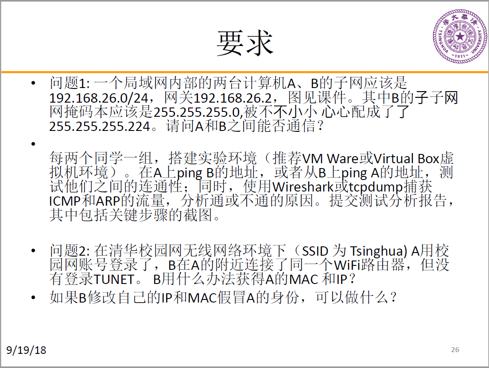
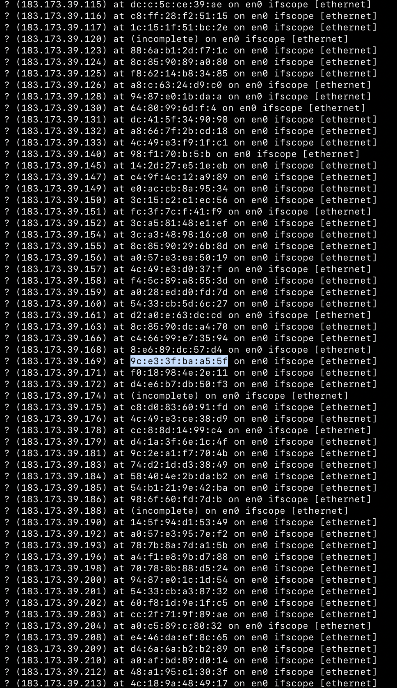

# 网络安全工程 实验1：ARP欺骗和IP假冒

## 实验要求



## 问题1

### 实验环境

各主机均为VMware下的虚拟机
- VMware：12.5.2
- 主机A：Ubuntu 16.04
- 主机B：LUbuntu 16.04

### 实验步骤

1. 首先配置虚拟子网VMnet2，将其设置为NAT模式（允许外部访问），子网IP为192.168.26.0/24，并在“NAT设置”中配置其网关IP为192.168.26.2，如下：

    
    
    
    
2. 将两个虚拟机的网络适配器连接至VMnet2，打开虚拟机，这时两台虚拟机都会获得自动分配的地址（由于虚拟子网打开了DHCP功能），同时可以互相ping通
3. 下面按照要求手动配置两台主机：
    - 主机A设置IP地址为192.168.26.129/24，其他不变（路由已经自动设置好）
        ```bash
        $ ifconfig ens33 192.168.26.129 netmask 255.255.255.0
        ```

        
    - 主机B设置IP地址为192.168.26.3/27，由于重设子网掩码，路由会被清除，因此重新设置路由为192.168.26.2
        ```bash
        $ ifconfig ens33 192.168.26.3 netmask 255.255.255.224
        $ route add default gw 192.168.26.2
        ```

        
4. 尝试互相通信，会发现主机A和B都可以ping通对方
    - A ping B

        
    - B ping A

        
5. 进一步分析，对A而言，由于子网掩码是255.255.255.0，因此两台主机的IP地址都在同一子网内，所以A可以直接向B发送数据包；但对B而言，由于其子网掩码为255.255.255.224，所以会判断A不在自己的子网内，于是会将数据包先发给网关192.168.26.2，再由网关转达给主机A，这一点可以用tcpdump观察
    ```bash
    $ tcpdump -i ens33
    ```
    主机B的结果如下，可以看到数据包通过了网关：

    
    另外，我们还能看到在第一次通过网关转达后，主机B就可以和主机A直接通信，这是因为更新了路由表。随后会有一次ARP包，是192.168.26.129询问192.168.26.3的MAC地址，这应该是为了防止ARP欺骗而清空了ARP缓存，于是发出更新ARP请求

## 问题2

### 实验环境

各主机为物理机，连接六教 `Tsinghua` 校园网。

- 被攻击者（A）：Windows 10
  - IP：183.173.36.172
  - mask：255.255.224.0
  - MAC：78:4f:43:5d:85:44
- 攻击者（B）：MacOS 10.14
  - IP：183.173.38.125
  - mask：255.255.224.0
  - MAC：c4:9d:ed:03:dd:40

### 实验步骤

1. B 修改 MAC 地址冒充 A 骗过校园网认证。

   B 首先观察自己的 IP 和 MAC 地址：

   ```bash
   ifconfig
   ```

   

   可看到其 IP 为 183.173.36.172，MAC 为 78:4f:43:5d:85:44。

   使用如下指令将 MAC 地址改为 A 的 MAC 地址：

   ```bash
   sudo ifconfig en0 ether c4:9d:ed:03:dd:40
   ```

   此时使用 `ifconfig` 观察，MAC 地址易发生改变，但 IP 地址尚未变化。

   

   但很快 B 的网络状态从“已连接”变成了“正在连接”，表示其在等待分配新的 IP 地址。待网络状态变回“已连接”，再次使用 `ifconfig` 观察，发现路由器已经根据 B 此时的 MAC 地址（A 的 MAC 地址），将 A 的 IP 地址给了 B。

   

   此时 B 打开浏览器上网，进入 net.tsinghua.edu.cn，发现无线网连接确实已被 A 同学认证，并且可以访问互联网。但同时也观察到，当 A、B 同时上网时，网络会变得非常卡顿，有时也会出现无法上网，需要多次刷新的情况。

2. 攻击者（B）获取子网中其他用户的 MAC 地址。

   使用 nmap 工具对子网进行扫描：（子网掩码为 255.255.224.0，共 19 位）

   ```bash
   nmap -sP 183.173.32.0/19
   ```

   

   

   发现使用此方法并不能有效获取子网内其他用户的 IP 以及 MAC 地址。

   因此使用如下指令，查看系统对 ARP 的缓存：

   ```bash
   arp -a
   ```

   

   可看到输出了所有在 nmap 时缓存的 IP 地址及其对应的 MAC 地址，而 B 的 IP（183.173.38.125）和 MAC（c4:9d:ed:03:dd:40）也在其中。

   但此方法的缺陷在于，上表中的 IP 并不都是终端设备。若是 B 将 MAC 改为了非终端设备的 MAC 地址，会产生虽分配到相应 IP 地址，却无法正常上网，甚至频繁掉线的现象。在尝试 2 次不同的 IP 对应的 MAC 地址后，我们发现上图中高亮选中的 MAC 地址属于一个终端设备。通过如下命令修改 B 的 MAC：

   ```bash
   sudo ifconfig en0 ether 9c:e3:3f:ba:a5:5f
   ```

   一段时间后使用 `ifconfig` 观察：

   

   发现成功修改了 MAC 地址，并且被自动分配到了该 MAC 地址对应的 IP 183.173.39.169。

   在浏览器中输入 net.tsinghua.edu.cn，结果如下：

   

   说明 B 确实使用这种方法成功盗用了陌生人的校园网账号，校园网验证方式存在漏洞。

3. 如果 B 修改 MAC 地址和 IP 地址冒充 A，可以做什么？

   在一些公共场合下，很多 WIFI 是无密码，开放连接，但是连接后需要通过短信或微信实名认证。在这种情况下，B 可以利用这种方式随机选取 A 并冒充，达到免认证上网，从而达到 B 的访问网络的真实身份（如 B 的 MAC 地址）被隐匿。

## 分工情况

