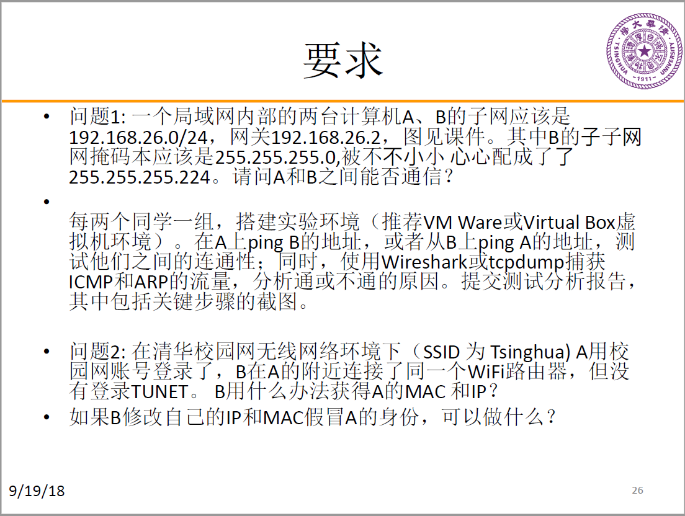

# 网络安全工程 实验1：ARP欺骗和IP假冒

## 实验要求

## 问题1

### 实验环境

各主机均为VMware下的虚拟机
- VMware：12.5.2
- 主机A：Ubuntu 16.04
- 主机B：LUbuntu 16.04

### 实验步骤

1. 首先配置虚拟子网VMnet2，将其设置为NAT模式（允许外部访问），子网IP为192.168.26.0/24，并在“NAT设置”中配置其网关IP为192.168.26.2
2. 将两个虚拟机的网络适配器连接至VMnet2，打开虚拟机，这时两台虚拟机都会获得自动分配的地址（由于虚拟子网打开了DHCP功能），同时可以互相ping通
3. 下面按照要求手动配置两台主机：

## 问题2

