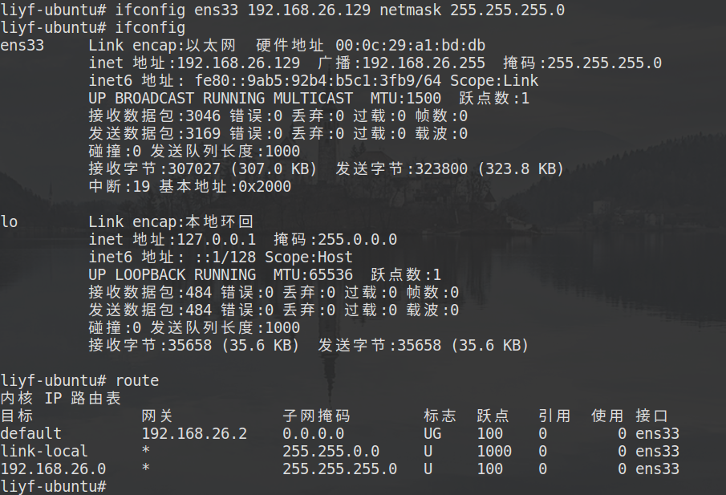
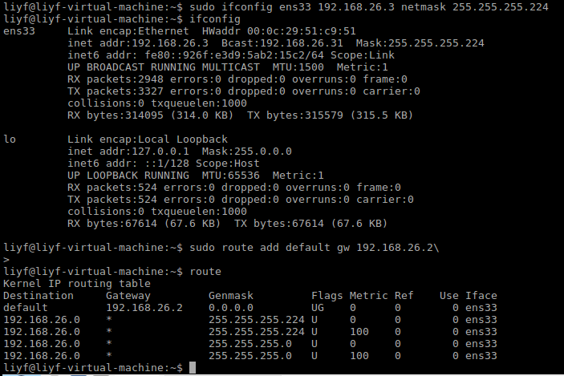
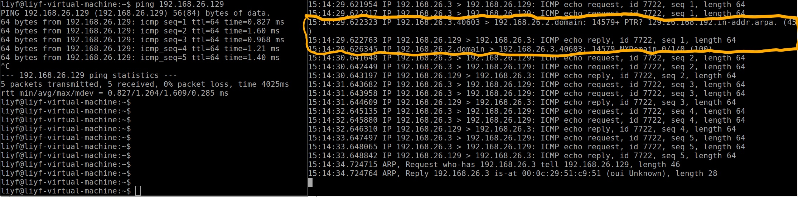

# 网络安全工程 实验1：ARP欺骗和IP假冒

## 实验要求


## 问题1

### 实验环境

各主机均为VMware下的虚拟机
- VMware：12.5.2
- 主机A：Ubuntu 16.04
- 主机B：LUbuntu 16.04

### 实验步骤

1. 首先配置虚拟子网VMnet2，将其设置为NAT模式（允许外部访问），子网IP为192.168.26.0/24，并在“NAT设置”中配置其网关IP为192.168.26.2，如下：
    
    
2. 将两个虚拟机的网络适配器连接至VMnet2，打开虚拟机，这时两台虚拟机都会获得自动分配的地址（由于虚拟子网打开了DHCP功能），同时可以互相ping通
3. 下面按照要求手动配置两台主机：
    - 主机A设置IP地址为192.168.26.129/24，其他不变（路由已经自动设置好）
        ```bash
        $ ifconfig ens33 192.168.26.129 netmask 255.255.255.0
        ```

        
    - 主机B设置IP地址为192.168.26.3/27，由于重设子网掩码，路由会被清除，因此重新设置路由为192.168.26.2
        ```bash
        $ ifconfig ens33 192.168.26.3 netmask 255.255.255.224
        $ route add default gw 192.168.26.2
        ```

        
4. 尝试互相通信，会发现主机A和B都可以ping通对方
    - A ping B

        
    - B ping A

        
5. 进一步分析，对A而言，由于子网掩码是255.255.255.0，因此两台主机的IP地址都在同一子网内，所以A可以直接向B发送数据包；但对B而言，由于其子网掩码为255.255.255.224，所以会判断A不在自己的子网内，于是会将数据包先发给网关192.168.26.2，再由网关转达给主机A，这一点可以用tcpdump观察
    ```bash
    $ tcpdump -i ens33
    ```
    主机B的结果如下，可以看到数据包通过了网关：

    
    另外，我们还能看到在第一次通过网关转达后，主机B就可以和主机A直接通信，这是因为更新了路由表。随后会有一次ARP包，是192.168.26.129询问192.168.26.3的MAC地址，这应该是为了防止ARP欺骗而清空了ARP缓存，于是发出更新ARP请求

## 问题2
