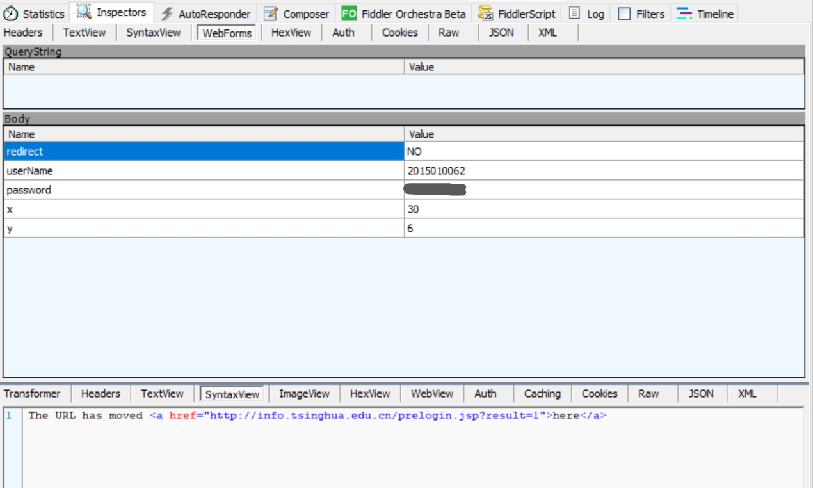
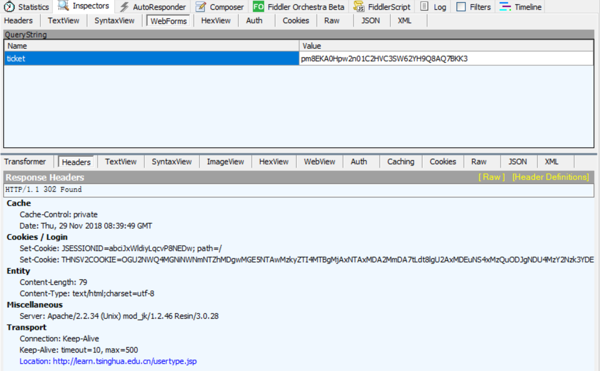
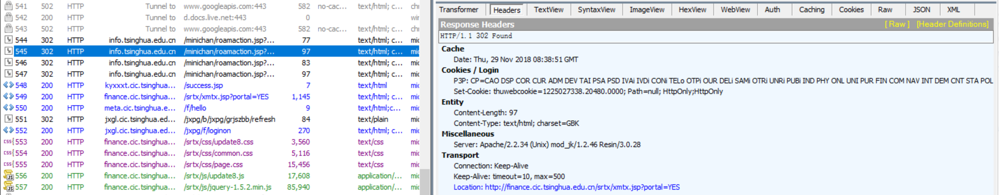

# 网络安全工程 实验4: 密码学

## Part 1: Linux 系统口令破译

### 实验要求

Linux下`passwd`生成如下口令

```text
test:$6$dRf2Gldj$W4DfAK9vGyz9XCCJrsPOtR7tgf3q6lDH92k
E2WKHNXZHfmu7dKFgo5M72jrL2hXJjxcdg596WsWPYYgGr
mPZp1:17107:0:99999:7:::
```
请破解口令明文

> 提示：该口令只有5个ASCII字符

### 密文分析

Linux下加密的口令保存在`/etc/shadow`下，只有root用户权限能够查看

保存加密后的密码和用户的相关密码信息，每一行代表一个用户，每一行通过冒号':'分为九个部分：

1. 用户名
2. 加密后的密码
3. 上次修改密码的时间(从1970.1.1开始的总天数)
4. 两次修改密码间隔的最少天数，如果为0，则没有限制
5. 两次修改密码间隔最多的天数,表示该用户的密码会在多少天后过期，如果为99999则没有限制
6. 提前多少天警告用户密码将过期
7. 在密码过期之后多少天禁用此用户
8. 用户过期日期(从1970.1.1开始的总天数)，如果为0，则该用户永久可用
9. 保留

那么，原密文可以分解为：

1. 用户名: test
2. 密码: `$6$dRf2Gldj$W4DfAK9vGyz9XCCJrsPOtR7tgf3q6lDH92kE2WKHNXZHfmu7dKFgo5M72jrL2hXJjxcdg596WsWPYYgGrmPZp1`
3. 17107
4. 0
5. 99999
6. 7

其他部分为空。

因此，我们只需要对密码的密文部分进行破解

密码密文具有如下格式：

```txt
$id$salt$encrypted
```

其中`id`表示加密算法; `salt`表示盐值(Salt), 由系统随机生成, 作用是混合入加密算法，使得即使是同一个密码，使用同一种加密方式，所产生的密文值也不同(类似密钥);`encrypted`表示密文。

`id`包含如下种类：

- 1: MD5
- 2a: Blowfish
- 2y: Blowfish
- 5: SHA-256
- 6: SHA-512

可见本密文中`id`为6，即SHA-512算法

本密文的`salt`为`dRf2Gldj`

### 密码破译

对于SHA-512算法，目前常用的破解方法主要为字典法和暴力法，较为实用的方法是利用相关软件进行破解。本实验中我们选用[`John the Ripper`](https://www.openwall.com/john/)破解工具，该工具对Linux的用户密码文件破译具有较高的针对性。

#### 实验平台

【乔总补充一下】

#### 工具安装

当前该工具存在一个社区加强版本[`bleeding-jumbo`](https://github.com/magnumripper/JohnTheRipper)，我们选用该版本，将git repo下载到服务器后，根据文档，编辑`Makefile`使其支持OpenMP，再执行`make`即可编译项目

#### 破解过程

由于已知密文的明文长度为5位，所以可以直接指定尝试的长度；同时，由于服务器为多核，可以定义环境变量`OMP_NUM_THREADS`，这样会自动使用OpenMP并行执行，加快破译速度。

```sh
$ export OMP_NUM_THREADS=24
$ run/john lab4 --min-length=5 --max-length=5
```

John the Ripper工具在破译时会首先用字典尝试常见的密码，在失败后，会进入暴力破解。问题中的密文不在工具的字典中，于是进入暴力破解过程，尽管服务器有24核，但仍然预期在12月9日才能穷尽5位的明文空间。


不过事实上，在两小时暴力尝试后就已经破译成功，明文为`tls13`。

### Reference

\[1\] [Understanding /etc/shadow file](https://www.cyberciti.biz/faq/understanding-etcshadow-file/)

\[2\] [Linux下的密码Hash——加密方式与破解方法的技术整理](https://3gstudent.github.io/3gstudent.github.io/Linux%E4%B8%8B%E7%9A%84%E5%AF%86%E7%A0%81Hash-%E5%8A%A0%E5%AF%86%E6%96%B9%E5%BC%8F%E4%B8%8E%E7%A0%B4%E8%A7%A3%E6%96%B9%E6%B3%95%E7%9A%84%E6%8A%80%E6%9C%AF%E6%95%B4%E7%90%86/)

\[3\] [linux密码暴力破解之SHA-512破解](https://blog.csdn.net/Key_book/article/details/80439243)

\[4\] [John the Ripper password cracker](https://github.com/magnumripper/JohnTheRipper/tree/bleeding-jumbo/doc)

## Part 2: 清华校园网身份认证及单点登录安全分析

### 实验要求

通过调研、实验操作等各种手段，给出你所认为的认证方法和过程（包括SSO），指出可能的威胁（给出具体的攻击方法，尽可能验证）

### 清华校园网联网方式

当前清华校园网包括有线的Ethernet（支持IPv4和IPv6，仅考虑IPv4）和无线网络（Tsinghua, Tsinghua 5G, 不考虑DIVI等支持IPv6协议栈的无线连接）。联网过程分为如下步骤：

1. 将网线接入主机，或连接清华无线网络Tsinghua/Tsinghua 5G
2. 通过DHCP，从校园网的DHCP服务器获取IP地址
3. 进行认证，获取网络访问能力

清华校园网支持的认证方式主要有两种：1）通过web页面进行认证；2）通过客户端进行认证。本实验将对PC端上两种认证方式进行分析

### 实验平台

- OS: Windows 10 Professional Build 1809
- 浏览器: Microsoft Edge 44.17763.1.0
- 认证客户端: TUnet 2015版

### 校园网身份认证方式分析

#### 1) Web页面认证（Wireless）

当前清华校园无线网的web页面认证已经支持HTTPS，下面的分析均基于HTTPS，通过验证，HTTP的过程相似。

##### 工具配置

为了监听HTTPS链接的内容，使用了`Fiddler`工具，通过MITM（中间人攻击）类似方法，由`Fiddler`生成一个CA根证书，信任该证书后，即可由`Fiddler`为站点签发证书，从而实现HTTPS监听。

在未配置CA证书前，如果试图监听HTTPS通信，可以看到`Fiddler`通过一个HTTP tunnel直接传输加密通信，无法获取其中内容


配置CA证书，`Fiddler`会随机生成一个根证书，需要使用者信任并将其添加到OS的信任根证书库中


随后再监听HTTPS链接，可以看到传输的具体内容


##### 过程分析

下面具体分析认证过程（无线网络）。截获的部分脚本保存在`code/`目录下，下文提到的脚本均位于此处。

###### 1. 登录

首先，在浏览器中访问`https://net.tsinghua.edu.cn`，该站点会将用户重定向到`https://net.tsinghua.edu.cn/wireless`，该站点的response为我们熟悉的认证页面


部分HTML如下，用户在该页面输入用户名和密码，提交，触发`do_login()`函数，该函数定义在`login.js`中

```html
<head>
    ...
    <script src="/script/jquery.js"></script>
    <script src="util.js"></script>
    <script src="md5.js"></script>
    <script src="login.js"></script>
</head>

<body id="non_phone">
    <div id="center">
        ...
        <div id="login">
            <form name="login_form" id="login_form" action="/do_login.php" method="post"
                    onkeydown="if(event.keyCode==13)do_login();" onsubmit="do_login();">
                ...
                <div class="field">
                    <div class="label_text" for="uname">用户名<p class="english">User&nbsp;ID</p>
                    </div> <input type="text" name="uname" id="uname" value="" autocorrect="off" autocapitalize="off">
                </div>
                <div class="field">
                    <div class="label_text" for="pass">密码<p class="english">Password</p>
                    </div> <input type="password" name="pass" id="pass" autocorrect="off" autocapitalize="off">
                </div>
                <div class="field" id="remember"> <input type="checkbox" name="save_me" id="cookie" value="yes">
                    <div class="checkbox_text">记住密码<p class="english">Remember&nbsp;Password</p>
                    </div>
                </div> <a id="account" href="https://usereg.tsinghua.edu.cn" title="账户设置&#10;Account&nbsp;Settings">账户设置
                    <p class="english">Account&nbsp;Settings</p></a> <input type="button" name="connect" id="connect" onclick="do_login();">
            </form>
        </div>
    </div>
</body>
```
在`login.js`中，`do_login()`定义为

```js
function do_login() { 	
    var uname = $('#uname').val();
    var pass = $('#pass').val();
    var ac_id = $('#ac_id').val();
    if (uname == '') {
        alert("请填写用户名");
        $('#uname').focus();
        return;
    }

    if (pass == '') {
        alert("请填写密码");
        $('#pass').focus();
        return;
    }
    //var topost = "action=login&username=" + uname + "&password={MD5_HEX}" + CryptoJS.MD5(pass) +
    var topost = "action=login&username=" + uname + "&password={MD5_HEX}" + hex_md5(pass) +
        "&ac_id="+ac_id;
	//alert(topost);
    //var res = post('/do_login.php', topost);
    $.post("/do_login.php", topost, function(res) {
   	if(res == "Login is successful.") {
            nav = navigator.userAgent.toLowerCase();
            var pp_nav = /safari/;
            var pp_mac = /mac/;
            if(pp_nav.test(nav) || (!pp_mac.test(nav))) {
            	if ($('#cookie')[0].checked) {
            	    $.cookie('tunet', uname + '\n' + pass,
            	        { expires: 365, path: '/' });
            	} else {
            	    $.cookie('tunet', null);
            	}
            }
            window.location="succeed.html";
	} else if(res == "IP has been online, please logout.") {
            alert("您已在线了");
	} else {
            var msg111 = get_err(res);
                        if(msg111 == "用户被禁用或无联网权限")
                        {
                                alert(res+" or max_online_num=0" + "("+msg111+")")
                        }
                        else
                        {
                                alert(res+"("+msg111+")");
                        }

        }
    }); 
}
```

可见，该函数会向`/do_login.php`发送POST，表单中包含用户名、密码等信息，其中密码是使用`md5.js`提供的`hex_md5()`进行MD5加密过的。随后，若用户选择了“记住我”，那么用户名和密码（ **注意 ：cookie中保存的密码为明文！！！** ）会被记录在本地的cookie中。

一个POST实例如下：


登录成功后，会跳转至`/wireless/succeed.html`，该页面加载完成后会调用`succeed.js`，查询用户在线状态：

```js
$(document).ready(function() {
	var r = post('/rad_user_info.php');
    var a = r.split(',');
    $('#uname').text(a[0]);
    var f = a[6] / 1000000000;
    if (f <=25) {
        len = f * 106 / 25
    } else if (f >25 && f <=55) {
	len = 106 + (f - 25) * (53 * 3) / 30
    } else {
	len = 280
    }
    //tm = Number(a[4]);
    tm = Number(a[2]-a[1]);
    $('#usage_value').css('width', len + 'px');
    $('#usage_flux').text(format_byte(a[6]));
    myclock();
});
```

通过POST到`/rad_user_info.php`，服务器会返回包括用户已用流量在内的用户信息如下：


至此，登录成功。


###### 2. 登出

登出时，只需点击页面上的“断开链接”按钮，这会调用`succeed.js`中的`do_logout()`函数

```js
function do_logout() {
	var topost = "action=logout";
    var res = post('/do_login.php', topost);
	if(res == "Logout is successful.")
	{
		alert("连接已断开");
        	window.location.href="/";
	}
	else
	{
		alert(res);
	}
	
	return;
}
```

该函数向`/do_login.php`POST一个`logout`的action，服务器终止当前连接如下：


###### 3. 在HTTP上的情况

在HTTP下情况类似，登录时同样用了MD5对用户名加密


但是，问题在于，HTTP request中都会包含cookie字段，而如果用户保存了密码，密码会以明文形式出现在该字段中，HTTP本身又是明文传输，那么用户名和密码的明文将可能被任何监听所截获！


#### 2) Web页面认证（Ethernet）

近期似乎由于校园网的一些变动，直接接入交换机的Ethernet需要通过`auth4.tsinghua.edu.cn`验证，而非像无线网络一样使用`net.tsinghua.edu.cn`，经过检验，实际上有很多不同之处。

##### 过程分析

###### 登录

类似的，抓包结果如下


注意到，尽管在输入时用了HTTPS地址`https://auth4.tsinghua.edu.cn`，但之后自动跳转都变成了HTTP，这样看似会有安全问题，但随后的分析显示，HTTP并不会导致类似无线认证那样的隐患。

有线认证步骤有所不同，这里应该是使用了SRUN协议，首先经过两次自动跳转，请求`/ac_detect.php`检测认证服务器，接着向`srun_portal_pc.php`发送GET请求获取登录页面：


部分HTML如下：

```html
<head>
    ...
    <script type="text/javascript" src="/script/md5.js"></script>
    <script type="text/javascript" src="/js/jquery.min.js"></script>
    <script type="text/javascript" src="js/jquery.cookie.js"></script>
    <script language="javascript" src="js/portal.main.min.js"></script>
    <script language="javascript" src="js/hashes.min.js"></script>
    ...
</head>

<body>
    <div id="center">
        ...
        <div id="content">
            ...
            <div id="login">
                <form name="form2" id="form2" action="srun_portal_pc.php?ac_id=1&" method="post">
                    ...
                    <label>
                        <div class="label_text">用户名<p class="english">User&nbsp;ID</p>
                        </div>
                        <input type="text" name="username" id="username" value="" autocorrect="off" autocapitalize="off"
                            onfocus="hidden_account()">
                        <div class="instruction" id="account">校园网账户<p class="english">Account&nbsp;of&nbsp;Tsinghua&nbsp;University&nbsp;Network</div>
                    </label>
                    <label>
                        <div class="label_text">密码<p class="english">Password</p>
                        </div>
                        <input type="password" name="password" id="password" autocorrect="off" autocapitalize="off">
                    </label>
                    <label id="remember" style="margin-left: 46px;">
                        <input type="checkbox" name="save_me" id="cookie" value="yes" checked>
                        <div class="checkbox_text" style="color: #93278f;font-weight: 600;">访问校外（IPv4）网络<p class="english">Access
                                to the Internet</p>
                            <p class="english">(IPv4)</p>
                        </div>
                    </label>
                    <a id="account" href="https://usereg.tsinghua.edu.cn" target="__blank" title="自服务&#10;Account&nbsp;Settings">自服务
                        <p class="english">Account&nbsp;Settings</p></a>
                    <input type="submit" class="connect" name="connect" id="connect" value="连接&nbsp;Contect">
                </form>
            </div>
            ...
        </div>
        ...
    </div>
    ...
</body>
```

表单内容类似，不同之处在于不再调用自行编写的函数，而是通过jQuery定义了表单提交行为。

另外比较tricky的一点是，原来的“记住我”不再使用，改为了“访问校外（IPv4）网络”，但表单id并没有改，还是“cookie”。不过事实上 **已经取消了cookie** ，这对安全性是一种提升，也使得HTTP传输内容不再包含用户名和密码的明文cookie。

分析一下对于表单提交的相应动作，在`portal.main.min.js`中：

```js
    $("#form2").submit(function(e) {
        e.preventDefault();
        var acid = $("#ac_id"),
            uname = $("#username"),
            pwd = $("#password"),
            uip = $("#user_ip");
        ...

        //login  认证
        var qData = {
            "action": "login",
            "username": uname.val(),
            //"org_password": pwd.val(),
            "password": pwd.val(),
            "ac_id": acid.val(),
            "ip": "",
            "double_stack": "1"
        };
        $.getJSON("/cgi-bin/srun_portal", qData, function(data) {
            if ($('#cookie')[0].checked == false) {
                uname.val(uname.val().replace("@tsinghua", ''));
            }
            if (data.error == "ok") {
                $.cookie('access_token', data.access_token);
                qData.password = pwd.val();

                var redirect = getUrlParam('userurl');
                if (redirect != ""){
                	location.href = redirect;
                } else {
	                if ($('#cookie')[0].checked == false) {
	                    location.href = location.protocol + "//" + location.hostname + "/succeed_wired.php?ac_id=" + acid.val() + "&username=" + data.username + "&ip=" + data.client_ip + "&access_token=" + data.access_token + "&access=no";
	                }else {
	                    location.href = location.protocol + "//" + location.hostname + "/succeed_wired.php?ac_id=" + acid.val() + "&username=" + data.username + "&ip=" + data.client_ip + "&access_token=" + data.access_token;
	                }
                }
                return false;
            }
            ...
        });
    });
```

可以看到，对于“cookie”（实际上是能否访问校外）的操作是，如果只能访问校内网，则在用户名后加入`@tsinghua`。

将登录信息组装成JSON后，调用定义好的`getJSON()`向服务器发送GET请求，该函数的认证方式很值得分析：

```js
    getJSON: function (url, data, callback) {
        if (url.match("srun_portal") != null || url.match("get_challenge") != null) {
            var enc = "s" + "run" + "_bx1",
                n = 200,
                type = 1,
                base64 = new Hashes.Base64();
            if (data.action == "login") { //login
                $data = data;
                return jQuery.getJSON(url.replace("srun_portal", "get_challenge"), {
                    "username": $data.username,
                    "ip": $data.ip,
                    "double_stack": "1"
                }, function (data) {
                    var token = "";
                    if (data.res != "ok") {
                        alert(data.error);
                        return;
                    }
                    token = data.challenge;
                    //$data.password = $data.org_password;
                    $data.info = "{SRBX1}" + base64.encode(jQuery.xEncode(JSON.stringify({
                        "username": $data.username,
                        "password": $data.password,
                        "ip": $data.ip,
                        "acid": $data.ac_id,
                        "enc_ver": enc
                    }), token));
                    //alert($data.info);
                    var hmd5 = new Hashes.MD5().hex_hmac(token, data.password);
                    $data.password = "{MD5}" + hmd5;
                    $data.chksum = new Hashes.SHA1().hex(token + $data.username + token + hmd5 + token + $data.ac_id + token + $data.ip + token + n + token + type + token + $data.info);
                    $data.n = n;
                    $data.type = type;
                    return get(url, $data, callback, "jsonp");
                });
            }
            ...
        }
```

用户点击“连接”后，首先会发出一个`get_challenge`的请求，如下：


对于response，做如下处理：

1. 服务器的response会携带一个叫做`challenge`的令牌（token）
2. 使用该token，调用定义好的`xEncode()`对用户登录信息（用户名，密码，IP，ac_id，enc_ver）进行编码
3. 再用`hashes.js`中的base64对上面的结果编码，并加`{SRBX1}`前缀，将结果作为`info`项插入JSON
4. 用`hashes.js`中的md5，利用token对JSON中的密码编码
5. 计算校验和
6. 将JSON通过GET请求发给服务器，请求如下（用户名后带有`@tsinghua`，说明只能访问校内网）：


该方法的安全之处在于，通过 **令牌交换** ，在加密中混入了随机因素，密码安全性大大提高，又通过`info`和校验和保证了信息的完整性和一致性（如对IP地址的验证），提高安全性能。而且令牌还有验证身份真实性的功能，服务器可以确定是否在与真实的客户端（拥有正确token）通信。此外，利用这种方法，即使HTTP明文传输也可以保证密码的安全（虽然用户名仍然可见）。

相较无线网，cookie中不再记录用户名和密码的明文，只记录了是否能访问校外，若不能，则`off_campus=off`，否则`off_campus=null`

成功后会请求`/succeed_wired.php`并收到成功页面。


###### 登出

登出时使用同一js脚本，只是表单变了。登出表单处理如下：

```js
    $("#form3").submit(function (e) {
        e.preventDefault();
        var uname = $("#username"),
            uip = $("#user_ip");
        //logout  注销
        var pData = {
            "action": "logout",
            "username": uname.val(),
            "ac_id": GetQueryString('ac_id'),
            "ip": "",
            "double_stack": "1"
        };
        $.getJSON("/cgi-bin/srun_portal", pData, function (data) {
            if (data.error == "ok") {

                alert("下线成功(Logoff Success)");
                window.setTimeout("window.location='http://info.tsinghua.edu.cn/'", 2000);
                return false;
            }
            ...
        });
```

使用类似的令牌交换方法，发送logout请求，成功后，将超时跳转至info页面（实际测试，在Chrome下可跳转，在Edge下无法跳转）。登出结果如下：


#### 3) 客户端认证（TUnet 2015）

似乎由于Ethernet使用新的协议，原有客户端（2015版）不再兼容，因此只实验无线网。对于客户端，`Fiddler`未能成功抓取到其流量，于是使用`Wireshark`抓取流量，抓到的包位于`package/`目录下。

##### 过程分析

首先，为了限定抓包范围，希望获取本机IP地址和认证服务器IP地址。本机地址可以用`ipconfig`查看，服务器地址用`dig`查看，地址为`166.111.204.120`

```sh
$ dig net.tsinghua.edu.cn
```


###### 登录

通过添加过滤条件，抓取的与认证服务器通信的流量如下：


可以看到进行了3次TCP连接：
1. 第一次连接建立后，进行了一次HTTP通信（上图中编号20 & 22，下同），这次通信内容为：
    
    通过GET请求内容判断，是一次强制下线
2. 第二次连接建立，进行一次HTTP通信（30 & 31），内容：
    
    通过GET请求获取用户状态，回复为“not_online”，用户当前不在线
3. 第三次连接建立，进行一次HTTP通信（41 & 42），这次对应着用户点击“连接”按钮，通信内容为：
    
    通过POST提交了表单，表单具体内容如下
    
    可见这里的密码已经是加密过的了

###### 登出

登出过程抓取的流量如下


前边几个UDP包推测为实时传输当前用量。随后点击“断开连接”时，会建立一个TCP连接，三次握手成功后，进行一次HTTP通信，内容如下


表单内容：


利用POST提交了logout的请求，同时还发送了用户名和mac地址，推测用于定位要下线的用户。

#### 4) 客户端认证（802.1x）

【待补充】

#### 5) PC端四种认证方式比对

目前的无线网认证是安全性能最低的，尤其是其允许HTTP传输，若用户选择了本地保存密码，则其信息将在cookie中被明文传输，非常脆弱。

客户端和新的Ethernet认证方式都比较安全，明文不会以任何形式出现在链路上。相较而言，可能客户端又更为安全，因为通过专用的TCP连接进行通信，而且客户端可拓展性更强，可能可以支持更多功能（如超时自动下线等）。

【待补充】

### 校园网单点登录（SSO）分析

经过观察和实验，我们发现的一种清华校园网支持的SSO情景为：登录info后，从info“综合”页面左侧的菜单直接进入“网络学堂”，这时网络学堂是免登录的，即实现了SSO。下面的分析主要基于这一情景。

#### 登录info

首先试图从Edge浏览器中登录info，并尝试用HTTPS方式，但页面无法正确加载，浏览器显示“页面存在不安全内容”，这时选择“显示全部”，即可加载完整的info页面。抓到的流量如下：


可以看到有些内容是HTTPS传输的，但仍然存在很多只支持HTTP的内容，这些内容都是info页面的组成部分。事实上，用Chrome的插件“HTTPS Everywhere”强制禁止所有非HTTPS内容，可以看到info页面会有部分内容无法加载（如“校园一卡通查询”），这些内容就是不支持HTTPS的组成部分。


输入用户名和密码后，登录info，会发送如下POST表单：

```js
<form id="login-form" action='https://info.tsinghua.edu.cn:443/Login' method="post">
    <input type="hidden" name="redirect" value="NO" />
    <td class="username">�û����� </td>
    <td class="srk"><input name="userName" id="userName" type="text" size="15" class="text" /></td>
    <td class="username">��&nbsp;&nbsp;�룺</td>
    <td class="srk"><input name="password" type="password" size="14" class="text" /></td>
    <td class="but" style="width:140px;">
        <input type="image" src="initial/all/images/t_09.gif" />&nbsp;
        <a href="https://id.tsinghua.edu.cn/f/recovery/password/reset" target="_blank">��������</a>
    </td>
</form>
```



可见发送的事实上是用户名和密码的 **明文** ，所以一定要使用HTTPS登录info！但是info本身又内嵌了许多不支持HTTPS的组成部分，这会给用户带来一定的安全隐患。

登录成功后，会重定向到info的web页面。

#### 基于ticket的SSO

##### 从info登录网络学堂

在登录info后，若点击左侧菜单里的“网络学堂”，就可以直接登录网络学堂而不需要再输入用户名和密码，该处的HTML如下

```html
<a target="_blank" class="left" href="/minichan/roamaction.jsp?id=105">网络学堂</a>
```

经过对抓取的流量进行分析，点击按钮后，向`/minichan/roamaction.jsp`发起了请求，参数为`id=105`，表示需要漫游的目标的代号。该请求及回复如下：


需要注意的是，SSO登录请求还需要 **cookie的支持** ，如上图，cookie中携带了一个`UPORTALINFONEW`值，这个值用于SSO服务器验证当前session的有效性（真实且未过期）。

随后跳转至response中的目标地址，注意到该目标地址为网络学堂`http://learn.tsinghua.edu.cn/roam.jsp`，同时携带了一个参数 **`ticket`**，即“票据”，它类似课上讲到的session ticket，用于一次验证成功后多次验证，而不需要重新协商，减轻负载加快访问速度。

这时重定向到上面得到的URL，即用ticket对网络学堂`learn.tsinghua.edu.cn`发出GET请求，结果如下：



可以看到，在用ticket请求后，对方服务器发回新的重定向URL，这是网络学堂页面加载的过程之一，随后将继续多次重定向并最终打开网络学堂，说明已经成功登录网络学堂。

##### info的模块加载

事实上这种方法在info中有很多应用。info页面由若干模块组成，如成绩，课表等，它们事实上分属不同的服务，由不同的域名负责，而且这些服务均需要登录。但是用户只需要登录info，这些服务就会自动登录认证并加载内容。这都是依靠前文提到的基于ticket的SSO方法实现的。info页面加载过程中的部分SSO流量如下所示



例如“教学日历”部分代码如下：

```html
<div id="9-792_table" class="tab_02 clearfix">
    <h4><a name="9-792"><span class="left ziti">教学日历</span></a></h4>
    <iframe width="100%" frameborder="no" bgcolor="#e8e8e9" marginheight="1" marginwidth="1"
        src="http://zhjw.cic.tsinghua.edu.cn/j_acegi_login.do?url=/jxmh.do&amp;m=bks_jxrl&amp;ticket=pm8EKA0Hpw2n01NLNLT44HNHQ6APWTCNXSD8" id="9-792_iframe">
        dummyText
    </iframe>
</div>
```

其中的`iframe`即为该模块，其`src`指向了获取日历的目标地址，其中携带了GET参数`ticket=pm8EKA0Hpw2n01NLNLT44HNHQ6APWTCNXSD8`，该参数为这一次登录info后获得的ticket，可以用它登录目标服务并获取内容。

### 校园网存在的漏洞和可能的攻击方案

【待补充】

### Reference

\[1\] [网络抓包工具 wireshark 入门教程](https://blog.csdn.net/zjy900507/article/details/79303359)

\[2\] [突破https——https抓包](https://blog.csdn.net/justfwd/article/details/78767328)

\[3\] [Fiddler抓取https设置详解](https://www.cnblogs.com/joshua317/p/8670923.html)

\[4\] [教学科研区无线网说明-清华大学信息化用户服务平台](https://its.tsinghua.edu.cn/helpsystem/wifi/NewWifiInstruction20181011.pdf)

\[5\] [无线校园网802.1x认证登录配置说明](https://its.tsinghua.edu.cn/helpsystem/wifi/tsinghua-secure-instruction20180905.pdf)

\[6\] [单点登录SSO的实现方式](https://blog.csdn.net/qq_30788949/article/details/79002652)
